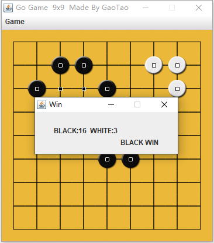

# Go
 The aim of this project is to make a 9x9 Go Game which has an AI that can satisfy most of the beginners of Go Game (like me).The difficulties of this project are to achieve the complicated rules of Go Game and build up an artificial intellgence(AI). 

*本项目的目的是做一个满足围棋初学者(像我一样菜)使用的、带有AI功能的9x9棋盘大小的围棋程序，难点是如何完成围棋复杂的游戏规则和建立一个可以自行落子的AI。*

## version 1.0
In the first version, the design of UI and Go ruleshas been achieved, which includes put stones, eat stones, count stones, count liberty,judge ko, etc.

*初版*

*在第一版中，完成了UI设计及围棋规则设计，包含了落子、吃子、数子、数气、劫争等规则。*

## version 2.0
In the second version, the design of AI has been achieved. The Minimax Algorightm based on Monte Carlo Method has been implemented. For the limits of the algorithm and my computer's performance, the standard 19x19 board is too big to calculate,the small 9x9 board is used.

*二版*

*在第二版中，完成了AI的设计。应用了基于蒙特卡洛方法的极小化极大算法。由于本算法和我的计算机性能的有限，19x19的标准棋盘太大，无法计算，因此只应用在了9x9小棋盘上。*

## examples
*效果图*

